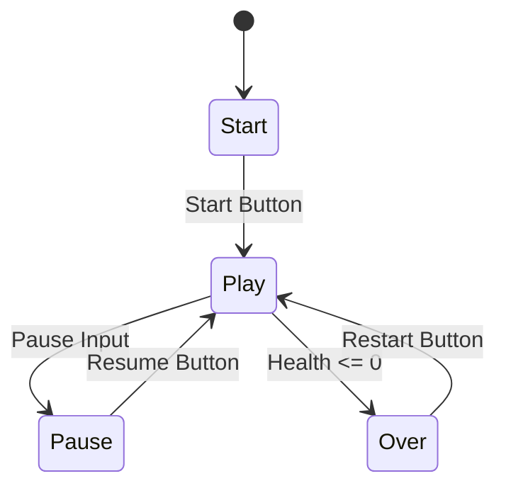
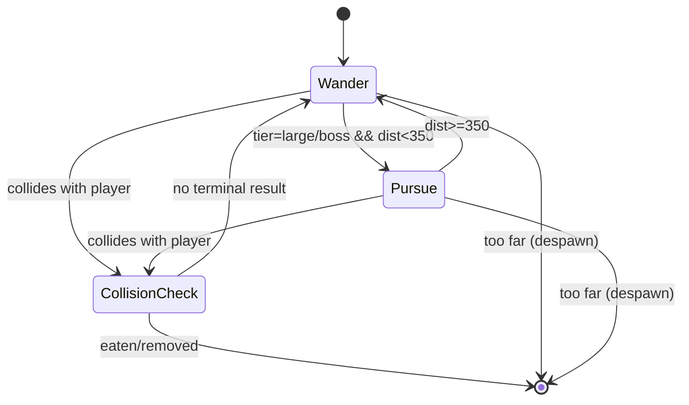

# DeepFeed (Angry Sharks) - Ringkasan AI, FSM, dan Referensi

Dokumen ini disusun agar **match** dengan implementasi game pada `script.js`, sesuai arahan tugas: AI harus ada di gameplay/core loop, wajib ada FSM, dan ada referensi jurnal yang diadopsi.

## 1. AI Pada Gameplay (Implementasi Nyata)

AI pada game ini berada di perilaku ikan NPC dan dinamika ancaman, bukan sekadar UI atau dokumen.

### 1.1 Perilaku ikan berdasarkan tier

- Ikan `tiny/small` tidak flee saat dekat player (tetap jadi target makan awal game) di [`script.js:1176`](/d:/DATA%20KULIAH/semester%206/GIM/Angry%20Sharks/script.js:1176).
- Ikan `large/boss` mengejar player ketika jarak cukup dekat (`distToPlayer < 350`) di [`script.js:1181`](/d:/DATA%20KULIAH/semester%206/GIM/Angry%20Sharks/script.js:1181).
- Semua ikan tetap punya perilaku `wander` acak dengan timer pergantian arah di [`script.js:1190`](/d:/DATA%20KULIAH/semester%206/GIM/Angry%20Sharks/script.js:1190).

### 1.2 AI menyesuaikan progres permainan

- Spawn ikan adaptif terhadap level dan kapasitas populasi di update loop [`script.js:962`](/d:/DATA%20KULIAH/semester%206/GIM/Angry%20Sharks/script.js:962).
- Spawn hazard (barrel/mine/harpoon) berbasis interval dan level sehingga tekanan meningkat seiring progres di [`script.js:981`](/d:/DATA%20KULIAH/semester%206/GIM/Angry%20Sharks/script.js:981), [`script.js:984`](/d:/DATA%20KULIAH/semester%206/GIM/Angry%20Sharks/script.js:984), dan generator hazard [`script.js:764`](/d:/DATA%20KULIAH/semester%206/GIM/Angry%20Sharks/script.js:764).

### 1.3 AI terhubung ke core loop

- Makan ikan memicu skor, combo, pertumbuhan, misi di fungsi `eatFish` [`script.js:1360`](/d:/DATA%20KULIAH/semester%206/GIM/Angry%20Sharks/script.js:1360).
- Tabrak musuh lebih besar/hazard memicu damage dan game over di `hurtPlayer` [`script.js:1413`](/d:/DATA%20KULIAH/semester%206/GIM/Angry%20Sharks/script.js:1413).

Core loop: `cari target aman -> makan -> tumbuh -> hadapi ancaman lebih agresif -> ulang`.

## 2. FSM Wajib

## 2.1 FSM State Utama Game

State utama game sudah eksplisit pada variabel `state`:
- `start | play | over | pause` di [`script.js:83`](/d:/DATA%20KULIAH/semester%206/GIM/Angry%20Sharks/script.js:83).

Transisi utama:
- `start -> play`: tombol mulai.
- `play -> pause`: tombol pause / input jeda.
- `pause -> play`: resume.
- `play -> over`: health habis.
- `over -> play`: restart game.

Diagram ringkas (Mermaid):

## 2.2 FSM Perilaku Ikan (AI NPC)

FSM konseptual ikan NPC (diturunkan dari implementasi update fish):

- `Wander`: ikan bergerak normal dengan pergantian arah periodik.
- `Pursue`: khusus `large/boss` saat player masuk radius kejar.
- `CollisionCheck`: cek hasil interaksi (dimakan / melukai player).
- `Despawn`: keluar dari area aktif pemain.

Diagram ringkas:

Catatan mapping ke kode:
- Kejar player: [`script.js:1181`](/d:/DATA%20KULIAH/semester%206/GIM/Angry%20Sharks/script.js:1181)
- Wander timer: [`script.js:1190`](/d:/DATA%20KULIAH/semester%206/GIM/Angry%20Sharks/script.js:1190)
- Collision eat/hurt: [`script.js:1241`](/d:/DATA%20KULIAH/semester%206/GIM/Angry%20Sharks/script.js:1241)
- Despawn jauh dari player: [`script.js:1232`](/d:/DATA%20KULIAH/semester%206/GIM/Angry%20Sharks/script.js:1232)

## 3. Referensi Jurnal AI dan Adopsi (Isi Singkat, Bukan Review Panjang)

Gunakan format ini agar sesuai arahan dosen: singkat, langsung ke adopsi, dan jelas tambahan dari tim.

### 3.1 Format tabel referensi

| No | Sitasi Jurnal | Konsep AI yang Diambil | Yang Diadopsi di Game Ini | Penambahan/Modifikasi Tim |
|---|---|---|---|---|
| 1 | [ISI SITASI JURNAL 1] | [contoh: FSM NPC, rule-based behavior] | NPC ikan punya mode wander/pursue berdasar jarak dan tier | Tambah tier tiny/small yang tidak flee agar onboarding lebih ramah |
| 2 | [ISI SITASI JURNAL 2] | [contoh: dynamic difficulty / pacing] | Spawn ikan dan hazard disesuaikan level/progres | Tambah burst spawn dan kombinasi hazard untuk menjaga tekanan |
| 3 | [ISI SITASI JURNAL 3] | [contoh: risk-reward loop] | Sistem combo + bonus fish + pertumbuhan ukuran | Integrasi misi progresif agar pemain terdorong eksplorasi |

### 3.2 Paragraf pembahasan singkat (siap pakai)

Implementasi AI pada game ini mengadopsi pendekatan behavior berbasis aturan sederhana (FSM/rule-based), lalu dikembangkan untuk kebutuhan arcade survival. Adopsi utama terlihat pada pemisahan perilaku NPC per-tier dan keputusan berbasis jarak terhadap pemain. Tim menambahkan modifikasi pada pacing permainan melalui spawn adaptif dan tekanan hazard bertahap agar kurva tantangan meningkat tanpa menghilangkan aksesibilitas pemain baru.

## 4. Checklist Kecocokan Game vs Dokumen

- [x] AI ada di gameplay (perilaku NPC + spawn/pacing), bukan hanya tulisan.
- [x] FSM state utama game dijelaskan.
- [x] FSM perilaku AI NPC dijelaskan.
- [x] Ada bagian referensi jurnal + kolom adopsi + penambahan.
- [x] Mapping poin penting ke baris kode implementasi.

## 5. Catatan Presentasi Singkat

Kalimat aman saat presentasi:
"AI di game kami ada di loop inti: NPC ikan memilih perilaku wander atau pursue berdasarkan tier dan jarak, lalu sistem spawn/hazard menyesuaikan progres level. FSM utama game dan FSM NPC kami lampirkan agar match antara desain dan implementasi."

